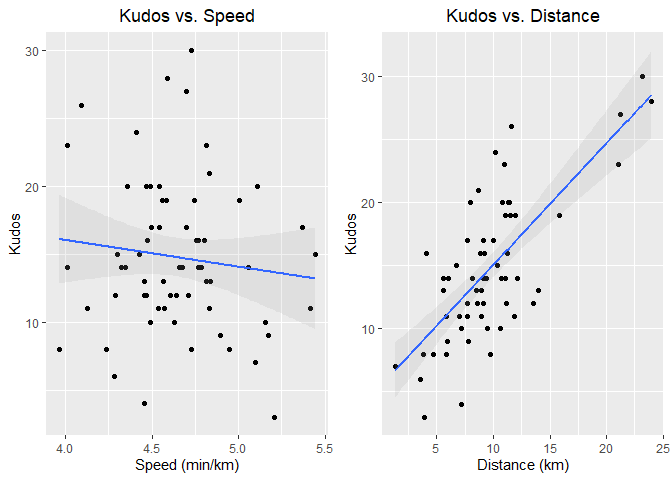
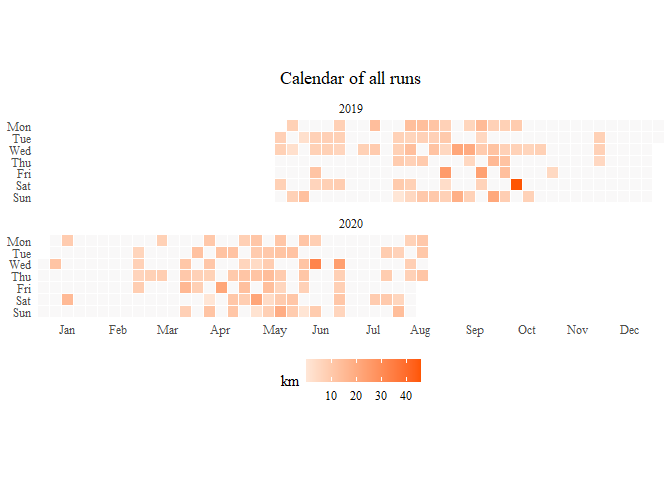

Strava Analysis
================

## Introduction

The idea of this project was primarily a way of putting into practice my
learnings from Jad Khalili’s [Udemy
Course](https://www.udemy.com/course/git-expert-4-hours/) on Git/GitHub.
I took this course in order to deepen my knowledge around best practices
in data science and source/version control.

In this course Jad covers:

  - An introduction to version/source control, Git and GitHub
  - Theory around repositories, the ‘staging area’, and basic/advanced
    Git commands
  - Git branches, and how to add, remove and merge them

The actual content of the project itself was a way to do some basic
analysis of my Strava data. Strava is an online ‘social-media’ platform
specifically desinged to connect athletes and allow them to share and
record their exercise activities.

To get access to my activity data I used the Strava API and the [rStrava
package](https://github.com/fawda123/rStrava), and in order to create
many of the visuals I used inspiration from [Marcus
Volz](https://github.com/marcusvolz/strava).

## Grab your attention

I thought this was an awesome plot that Marcus Volz made - so simple yet
effective in visualising all your activities in one plot.

<!-- -->

## Using the Strava API

The Strava API allows you to pull all of your activities into a data
frame, which each row representing an aggreagted view of your
run/cycle/swim. It contains information such as: date, distance, time,
speed, elevation, heart-rate etc.

This aggregated view allows you to look at some high level data of your
activities.

### Speed vs Distance

What happens to my speed as the distance I run get longer…. pretty
obvious. The one interesting thing was that my runs in the *6km to 9km*
range were on **average** faster than the *Under 6km* range. However,
looking at the **median** the *Under 6km* runs are faster. My guess is
that occasionally when I am not feeling up for a run, I will just head
out for a short and slow run which is skewing these means.

<table>

<thead>

<tr>

<th style="text-align:left;">

distance\_bucket

</th>

<th style="text-align:right;">

Number of Runs

</th>

<th style="text-align:right;">

Average Distance

</th>

<th style="text-align:right;">

Average Speed

</th>

<th style="text-align:right;">

Median Speed

</th>

</tr>

</thead>

<tbody>

<tr>

<td style="text-align:left;">

\< 6km

</td>

<td style="text-align:right;">

20

</td>

<td style="text-align:right;">

4.489070

</td>

<td style="text-align:right;">

4M 29S

</td>

<td style="text-align:right;">

4M 22S

</td>

</tr>

<tr>

<td style="text-align:left;">

6km - 9km

</td>

<td style="text-align:right;">

65

</td>

<td style="text-align:right;">

7.435383

</td>

<td style="text-align:right;">

4M 27S

</td>

<td style="text-align:right;">

4M 27S

</td>

</tr>

<tr>

<td style="text-align:left;">

9km - 12km

</td>

<td style="text-align:right;">

42

</td>

<td style="text-align:right;">

10.384460

</td>

<td style="text-align:right;">

4M 33S

</td>

<td style="text-align:right;">

4M 33S

</td>

</tr>

<tr>

<td style="text-align:left;">

12km - 15km

</td>

<td style="text-align:right;">

14

</td>

<td style="text-align:right;">

12.998479

</td>

<td style="text-align:right;">

4M 36S

</td>

<td style="text-align:right;">

4M 37S

</td>

</tr>

<tr>

<td style="text-align:left;">

\> 15km

</td>

<td style="text-align:right;">

15

</td>

<td style="text-align:right;">

22.594313

</td>

<td style="text-align:right;">

4M 43S

</td>

<td style="text-align:right;">

4M 44S

</td>

</tr>

</tbody>

</table>

<!-- -->

### Most importantly, how do I get Kudos?

The social-media part of Strava allows users to like each others
activities that they have posted, in Strava, this is called giving
**‘Kudos’**. I wondered what the best way to get Kudos from my Strava
community was. Do they prefer fast runs, or longer runs?

I should note that around mid-late April 2020 I synced my Strava with my
Facebook account meaning I was now connected to a larger community of my
friends. Hence, to make this a fair, I will only be looking at my runs
after April 24th 2020.

<!-- -->

A linear regression run of *Kudos = Distance* gives a coefficient of
0.5405. This means I should expect to get 1 kudos for every 540m run.

    ## 
    ## Call:
    ## lm(formula = kudos_count ~ 0 + speed_min_km, data = acts)
    ## 
    ## Coefficients:
    ## speed_min_km  
    ##         1.62

    ## 
    ## Call:
    ## lm(formula = kudos_count ~ distance, data = acts)
    ## 
    ## Coefficients:
    ## (Intercept)     distance  
    ##      1.9404       0.5394

The evidence from this very detailed analysis is clear…

DISTANCE = KUDOS

## Visualising GPS data

Strava members are also able to access their Strava data by requesting
an archive of all of their activities
[here](https://support.strava.com/hc/en-us/articles/216918437-Exporting-your-Data-and-Bulk-Export).
Following these instructions allows you to get a mass export of all
data, and most importantly it includes the actual GPS data files that
contains latitude and longitude data. These files vary based on the
method of recording your activities - my Samsung Galaxay Watch records
them as GPX files.

This is how many of Marcus Volz’s creative plots can be generated:

### Running frequency

You will notice there are two main periods that I have maintained
consistent uploads to Strava:

1.  Mid 2019 - in preparation for a marathon in Oct 2019 (dark red
    square)
2.  Early 2020 - motivation to start running consistently again as
    Melbourne went into Covid lockdown

<!-- -->

### Where have I been running?

The following plot shows my runs placed on a map, with the darkness of
the lines indicating the number of times I have run over a particular
part of Melbourne. Three things to note:

1.  You’ll notice there are two main parts of town that are darker than
    the rest. These represent when I moved house from Fitzroy North to
    Richmond.
2.  The route at the bottom of the map is the marathon route that takes
    you down St Kilda.
3.  The run I did where I spelt out my name (ANDY) :)

<!-- -->

### What time of the day?

This visual allows you to see the frequency of your runs by time of day
and day of week. I clearly prefer to run after work on Monday -
Thursday, in the mornings on Friday and Saturday, and across the day on
Sundays.

    ## Picking joint bandwidth of 2500

<!-- -->

I thought it might be interesting to see how this distribution changed
between last year and this COVID affected year. During COVID I have been
working from home, which has given me the flexibility to run during the
day. And sure enough, you can see that in the post-COVID plot, my runs
have been much more dispersed across the day compared to pre-COVID.

<!-- -->

## Conclusion
