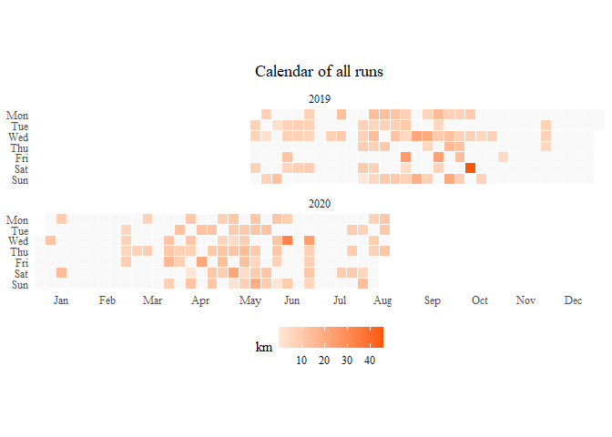
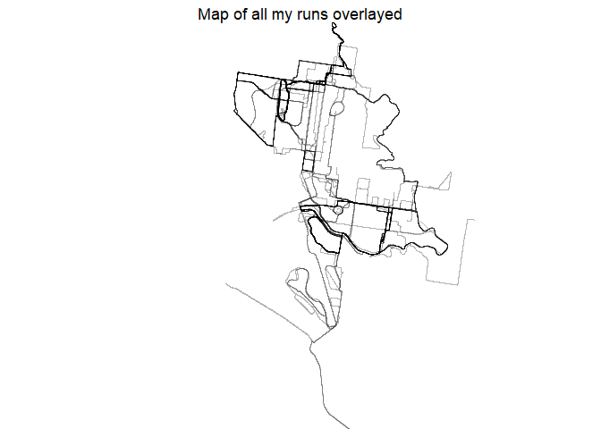

Strava Analysis
================

## Introduction

The idea of this project was primarily a way of putting into practice my
learnings from Jad Khalili’s Udemy Course on Git/GitHub (Git: Become an
Expert in Git & GitHub in 4 Hours). I took this course in order to
deepen my knowledge around best practices in data science.

In this course Jad covers:

  - An introduction to version/source control, Git and GitHub
  - Theory around repositories, the ‘staging area’, and basic/advanced
    Git commands
  - Git branches, and how to add, remove and merge them

The actual content of the project itself was a way to do some basic
analysis of my Strava data. Strava is an online ‘social-media’ platform
specifically desinged to connect athletes and allow them to share and
record their exercise activities.

To get access to my activity data I used the Strava API and the [rStrava
package](https://github.com/fawda123/rStrava), and in order to create
many of the visuals I used inspiration from [Marcus
Volz](https://github.com/marcusvolz/strava).

## Grab your attention

<!-- -->

## Visualising my Runs

Strava members are also able to access their Strava data by requesting
an archive of all of their activities
[here](https://support.strava.com/hc/en-us/articles/216918437-Exporting-your-Data-and-Bulk-Export).
Following these instructions allows you to get a mass export of all
data, and most importantly it includes the actual GPS data files that
contains latitude and longitude data. These files vary based on the
method of recording your activities - my Samsung Galaxay Watch records
them as GPX files.

This is how many of Marcus Volz’s creative plots can be generated:

# Running frequency

You will notice there are two main periods that I have maintained
consistent uploads to Strava:

1.  Mid 2019 - in preparation for a marathon in Oct 2019 (dark red
    square)
2.  Early 2020 - motivation to start running consistently again as
    Melbourne went into Covid lockdown

<!-- -->

# Where have I been running?

The following plot shows my runs placed on a map, with the darkness of
the lines indicating the number of times I have run over a particular
part of Melbourne. Three things to note:

1.  You’ll notice there are two main parts of town that are darker than
    the rest. These represent when I moved house from Fitzroy North to
    Richmond.
2.  The route at the bottom of the map is the marathon route that takes
    you down St Kilda.
3.  The run I did where I spelt out my name (ANDY) :)

<!-- --> \# What time of
the day?

This visual by Marcus allowsyou to see the frequency of your runs by
time of day and day of week.

    ## Picking joint bandwidth of 2500

<!-- -->

I thought it might be interesting to see how this distribution changed
between last year and this COVID affected year where I have been working
from home and have had the flexibility to run during the day. And sure
enough, you can see that in the post-COVID plot, my runs have been much
more dispersed across the day compared to pre-COVID.

    ## Picking joint bandwidth of 1450

    ## Picking joint bandwidth of 3370

<!-- -->
